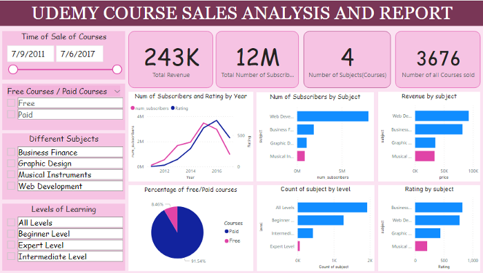
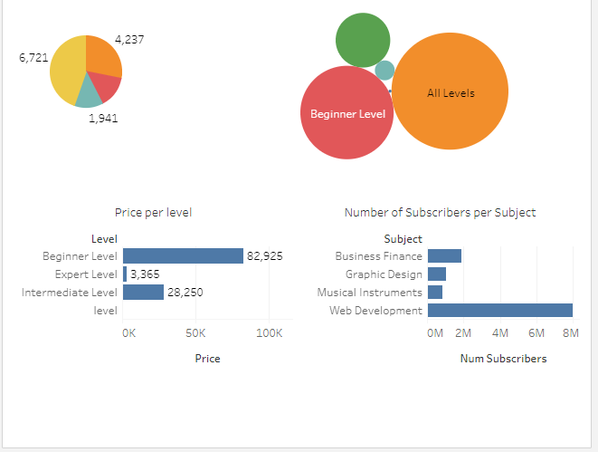

# Udemy-Course-Analytics

In August 2021, I was a Data Analyst Intern with EntryLevel although a Virtual internship. This project was the Capstone project that was done to demonstrate my understanding of the role of a Data Analyst. 

## **Project Description:**

What is the need for being in business and having a company when you can’t track your business performance to know where the gold of your business resides? How will you know your customer’s need in order to serve them appropriately?

This was the situation of the Education tech company-Udemy who wants data-driven insights into their business. The company presented the data on course revenue showing different data on the different courses and topics to understand where opportunities abound and then track the performance of courses.

To determine where the gold lies, data sheets/spreadsheets for four subjects (Business Courses, Design Courses, Web Development and Music courses) were provided. Each spreadsheet contains Course iD, course title, URL, price, number of Subscribers, number of reviews, number of lectures, level, rating and time (duration) they took the course.

The period under review is 9th July, 2011 to 6th July, 2017

## **The problem**
Considering the available data, Certain questions are to be answered, such as?

* How to generate revenue from sales of courses
* How to track course performance
* What course has the highest sale?
* what course has the lowest sale?
* What determines the purchase rate of courses?

## **The Design**
In order to get meaningful insights from the data, It needed to be cleaned and made ready for analysis. The essence of thorough cleaning and evaluation of the data sets is to ensure that our data has quality, is accurate, complete, consistent, unique, valid, unique, current and relevant to our analysis. The steps taken to clean the data and prepare for analysis are:

* Consolidation of data
* Reformatting of cells
* Deleting duplicate columns
* Removing blank cells, removing headers
* Right/left function: to change the published time format into appropriate formats
* Find and replace function: to make all the subjects have same format
* IF function: to know the courses that are free or paid
* Vlookup: to know the top 20 most subscribed course.

A clean data will enable us carry out analysis that will make smarter business decisions based on facts, not instinct. It will also enable us win new students, make more revenues and reduce business risk.

**Microsoft Excel** was used for analysis because from its numerous functions, pivot tables and built-in analytic tools, it helps to analyze, visualize and gain insights from data.
**Tableau** being a data visualization tool that the business intelligence industry leverages on, was also used since it helps in sampling raw data in a very easy and understandable format.

## **Findings**

This shows that:

* a) there are 4 distinct courses in review: Business Finance, Graphic Designs, Musical Instruments and Web development.
* b) review period is between 9th July 2011 to 6th July 2017.
* c) levels of learning considered are: all levels. beginners level, intermediate and expert level
* d) There are 3676 courses that were registered for
* e) Total number of subscribers is approximately 12 million
* f) Total revenue is 243,000.

Here, we understand that 92% of everyone that took the courses found it worth their money. So, they paid for the courses, and they will be willing to pay as long as they continue to get value for their money.

From the chart above, it is observed that Web Development is the subject that **68%** of the subscribers went for. It accounted for 8 million subscribers. Followed by Business Courses which has about **16%** of the total subscribers and has 2 million subscribers. The last being Musical Instrument which accounted for **7%** and about one million subscribers. The gap between the first and second is quite high and it feels so good to know that people want to learn and venture into website development owning to the fact that virtually every business wants to have an online presence, all thanks to the internet sensitization programs that are held for business owners.

It is also seen that the rating increased significantly from 2011 until early 2016 and began to drop. As the ratings dropped, the number of subscribers also dropped and the revenues dropped too.

**Business finance** has the highest rating of courses followed by the **Web development** little wonder business finance is seen to be next with the highest subscribers just after web development.
                                                
                                                    

                       
We observed that the beginners level had the highest revenue **($82,925)** for the company followed by the intermediate level **($28,250)**.

## **Root Cause Analysis:**

From the vlookup that was done with excel, Web development course has 17 out of 20, musical instrument has 2 and Business Finance has just 1 course. Majority of these 20 courses are free(12 out of 20), perhaps that's why people took the courses. Web development courses ranked highest by number of subscribers possibly because they have more free courses, aside that, they wouldn't have had that much number, seeing that the course rating is lower compared to business finance. Despite the fact that web development had more free courses, it was able to generate the highest revenue because the paid courses have higher amount in comparison to others.

For Business Design: they are the course with the second largest number of subscribers, they also have the highest rating out of the four courses and also that gave the company the second highest revenue. Despite the wide gap in number of subscribers between web development and business finance, business finance generated a revenue that is not far from the revenue of web development. This is to show that the course is doing very well and has potential to generate more revenue.

Graphic Design: It has the 3rd highest subscribers and the third revenue generating course, the rating per subject too is far compared to the number of subscribers that it has. This is another course that has potential to generate more revenue if looked into.

The Music course is the course with the lowest subscriber, revenue and also rating. It is not quite popular hence the low subscription or perhaps interest of people are not here.

## **Conclusion:**

There is a high demand for web development courses, so the course facilitators should create more web development courses with high rating and content so that people can subscribe, and move to the intermediate level. However, the high cost of these web development courses should be reconsidered. Instead it should be reduced and more content be poured.

Business Finance courses are the next in demand. Hence there is also a market for business courses. In a bid to diversify and get more revenues, more business courses either free or paid should be created with quality rating to maintain the set standard already. Knowing that subscribers increase as the rating of the courses increases.

72% of people bought the beginner level and 25% proceeded to buy the intermediate courses. From this, there is a huge gap, perhaps not enough satisfaction was gotten from the beginners level that made those that migrated to intermediate level low. So at all level of learning, every course is important. the content duration, quality and rating shouldn't be compromised.

Graphics Design courses have high potential to generate more revenue for the company by increasing the price of the course since its rating is fair.
